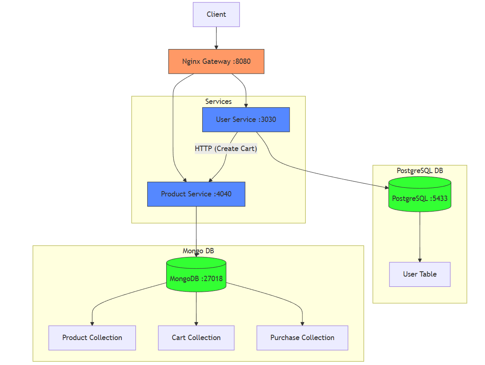

# Teste Técnico -  Quero Delivery

Esse repositório contém o teste técnico realizado com Typescript/Node/Express/MongoDB/PostgreSQL. O projeto tem como objetivo simular um sistema de microserviços com integração entre API de usuários e API de produtos, além de fornecer funcionalidades de carrinho de compras utilizando MongoDB.

## Atenção ao rodar

O projeto usa várias portas. Caso essas portas estejam em uso, será necessário modificá-las no arquivo `docker-compose.yml`:

1. **MongoDB (Banco de Dados)**:  
    - `27018:27017` | container_mongo_database

2. **PostgreSQL (Banco de Dados)**:  
    - `5433:5432` | container_postgres_database

3. **API de Produtos (Product Service)**:  
    - `4040:4040` | api_product_service

4. **API de Usuários (User Service)**:  
    - `3030:3030` | api_user_service

5. **Nginx (Gateway)**:  
    - `8080:8080` | nginx_gateway

O Docker Compose é utilizado para orquestrar os contêineres, com variáveis de ambiente configuradas para as duas APIs. Certifique-se de que todos os processos do compose rodaram com sucesso.

## Tabela de Conteúdo

- [Arquitetura](#arquitetura)
- [Entidades](#entidades)
- [Instalação](#instalação)
- [Informações](#informações)

## Arquitetura
<div align="center">
     
</div>

## Entidades

O projeto inclui as seguintes entidades:

### User
- `id`: Identificador único do usuário. (uiid)
- `username`: Nome de usuário.
- `password`: Senha do usuário.
- `email`: Email do usuário.
- `created_at`: Data de criação do usuário.
- `updated_at`: Data de atualização do usuário.
- `deleted_at`: Data de deletação lógica do usuário.

### Product
- `_id`: Identificador único do mongo.
- `uid`: Identificador único do produto.
- `name`: Nome do produto.
- `description`: Descrição do produto.
- `price`: Preço do produto.
- `createdAt`: Data de criação do produto.
- `updatedAt`: Data de atualização do produto.
- `deletedAt`: Data de deletação lógica do produto.

### Cart
- `_id`: Identificador único do mongo.
- `uid`: Identificador único do carrinho.
- `owner`: Identificador do usuário dono do carrinho.
- `products`: Lista de produtos no carrinho.
- `totalPrice`: Preço total do carrinho.
- `createdAt`: Data de criação do carrinho.
- `updatedAt`: Data de atualização do carrinho.

### Purchase
- `_id`: Identificador único do mongo.
- `uid`: Identificador único da compra.
- `owner`: Identificador do usuário dono da compra.
- `products`: Lista de produtos comprados.
- `totalAmount`: Preço total da compra.
- `createdAt`: Data de realização da compra.
- `updatedAt`: Data de atualização da compra.

## Instalação

### Pré-requisitos
Para rodar o projeto é necessário ter o Docker e Docker Compose instalados.

### Passos de instalação

```bash
# Clone o repositório
git clone https://github.com/Arturstriker3/test-querodelivery

# Navegue até o diretório do projeto
cd test-querodelivery

# Execute o comando para rodar o banco de dados e o backend juntos, dockerizados
docker-compose up -d
```

## Informações

O projeto já está configurado com um **gateway NGINX** que facilita o acesso aos endpoints dos microserviços. A seguir, veja como interagir com a documentação e consumir os serviços disponíveis:

### 1. Acessando a Documentação

A documentação detalhada dos endpoints expostos pelo gateway pode ser acessada em:

http://localhost:8080

Ao acessar este endereço no seu navegador, você verá uma interface interativa que permite navegar pelas rotas e visualizar os parâmetros de cada endpoint disponível.

### 2. Consumindo os Endpoints

Através do gateway, você pode acessar os microserviços de forma simplificada. Abaixo estão alguns exemplos de como consumir os endpoints para os serviços de **usuários** e **produtos**:

- **Serviço de Usuários**: 
http://localhost:8080/users

- **Serviço de Produtos**: 
http://localhost:8080/products